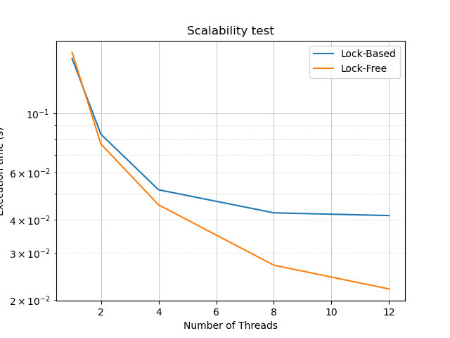
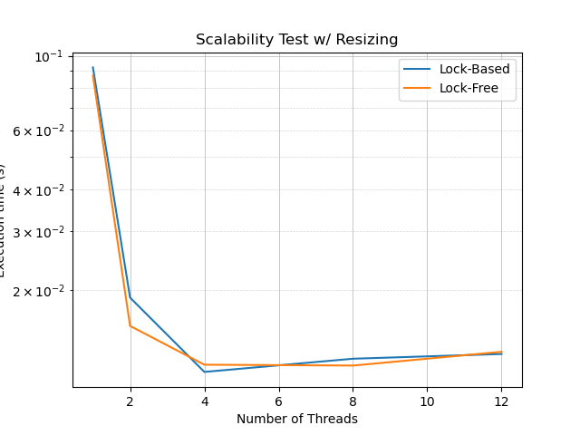
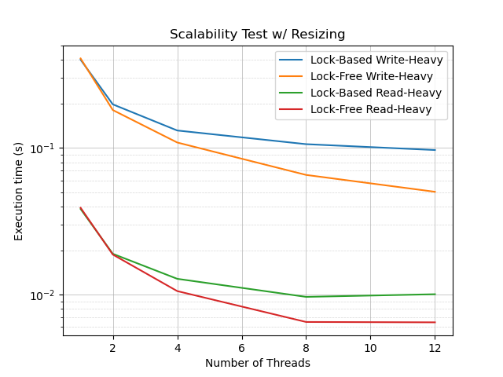

# Multiprocessor Programming Final Project

## Summary

This project implements and evaluates the performance of a bucketized chained hash table in a concurrent environment. Traditional hash tables are often not thread-safe, and applying a global lock creates a significant bottleneck in multiprocessor systems. To address this, two thread-safe implementations were developed in C using OpenMP:

1. **Lock-Based Strategy (Striped Locking):** Spreads a fixed number of locks across all hash indices, allowing multiple indices to share a single lock. This reduces memory overhead compared to a fine-grained lock-per-bucket approach while mitigating contention.
2. **Lock-Free Strategy (Compare and Swap):** Eliminates locks entirely by relying on Michael-Scott queue mechanics and OpenMP's atomic compare capture to safely swap new nodes onto the head of each bucket's linked list.

The goal is to demonstrate the efficiency differences between these two approaches under various workloads and contention levels.

---

## Technical Details

### Lock-Based Implementation
The striped lock implementation maps `N` buckets to `M` locks using the modulo operator (`N % M`). If a thread needs to lock a specific bucket, it effectively locks all buckets mapped to that lock. To optimize cache performance and avoid false sharing (cache line bouncing), a `PaddedLock` struct is used, ensuring that individual locks reside on different cache lines.

### Lock-Free Implementation
The lock-free implementation uses linked lists for the buckets. It relies on a compare-and-swap (CAS) loop to handle race conditions on the head pointer of each bucket:

1. The thread reads the current head of the target bucket.
2. It creates a new node, setting its `next` pointer to the current head.
3. It attempts to swap the current head with the new node using `#pragma omp atomic compare capture`.
4. If another thread has modified the head in the meantime, the CAS fails, and the thread retries the loop until successful.

When updating existing values, `#pragma omp atomic write` guarantees no thread sees a torn value. Lookups use `#pragma omp atomic read` for memory consistency.

### Solution Correctness and the ABA Problem
The ABA problem is a common issue in lock-free linked lists where a node is read, deleted, reallocated, and modified before a pending thread completes its operation. To avoid this entirely, the current implementation only supports inserting and updating operations. Nodes are never deleted and freed, removing the risk of the ABA problem without the overhead of hazard pointers.

### Experimental Results
Performance differences are most pronounced under high contention. For larger hash tables where contention is naturally low, the lower overhead of striped locking can be more efficient. However, under high contention, the lock-free compare-and-swap method generally outperforms striped locking.

#### Balanced Workload (No Resizing)
In a balanced workload without table resizing, the lock-based implementation plateaus quickly (around 8 threads) due to contention on the locks. The lock-free implementation continues to scale and yields faster execution times.



#### Balanced Workload (With Resizing)
When parallelized resizing is enabled, all threads must sync before and after the resize operation. These barriers effectively act as a global lock and mask the marginal performance gains of the lock-free approach, making both implementations perform similarly.



#### Heavy Writing and Heavy Reading Workloads
In write-heavy scenarios, lock contention increases, leading to more compare-and-set failures in the lock-free version. Conversely, read-heavy workloads generate less contention because lookups only require atomic reads.



---

## How to Run

Run `run.sh` to run specific configurations

Compile command:
```bash
gcc -fopenmp main.c chained_locked.c -o chained_locked.exe
gcc -fopenmp main.c chained_lock_free.c -o chained_lock_free.exe
```

Options:
- `-f` -> Data file path
- `-b` -> Initial number of buckets (hash table size)
- `-t` -> Number of threads
- `-r` -> Disable resizing
- `-s` -> Disable metric tracking for speed test

Already generated data is in `datasets`

### Data Generation

Generate data using `python_data_generator.py`

Multiple configuration options and examples available

### Graph Generation

Manually put in speed test results into `generate_graphs.py` to generate graphs for the specific configuration you want to see.